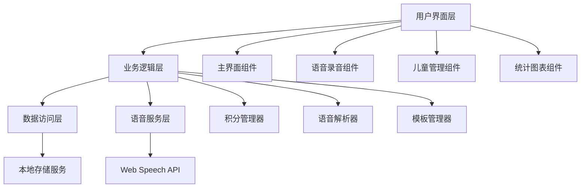
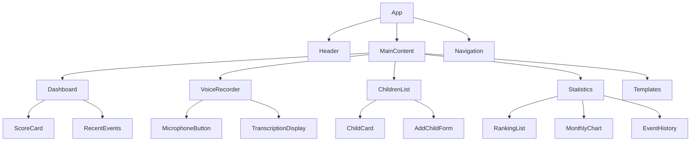
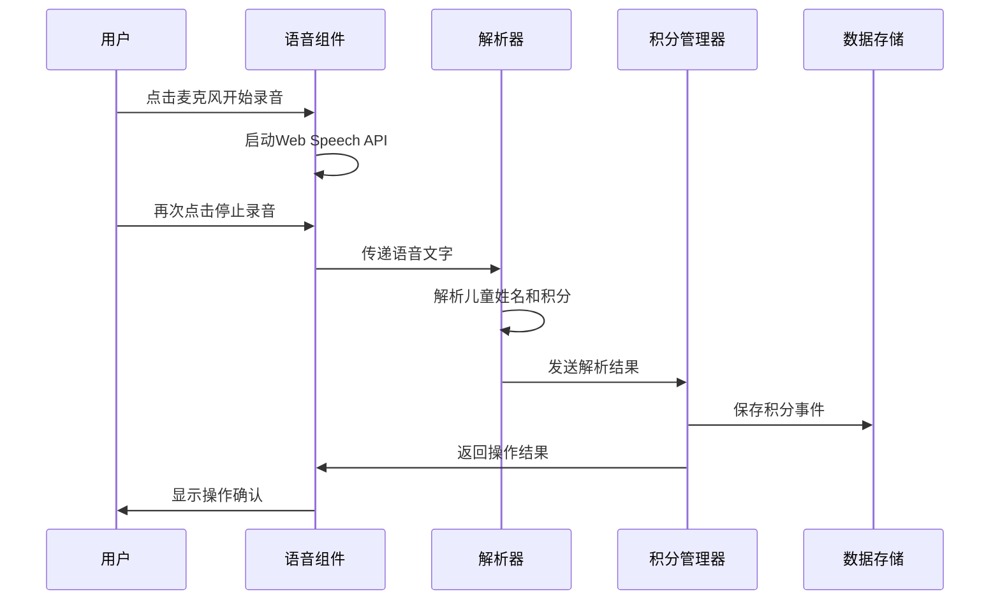

# 设计文档

## 概述

儿童成长追踪器是一个基于Web技术的移动优先应用程序，使用React和TypeScript构建。应用采用现代化的卡通风格设计，通过语音交互和智能解析功能，让家长能够快速便捷地管理多个孩子的积分系统。

核心技术栈：
- 前端：React + TypeScript + Vite
- 语音识别：Web Speech API (SpeechRecognition)
- 状态管理：React Context + useReducer
- 样式：CSS Modules + CSS变量
- 数据存储：localStorage
- 构建工具：Vite

## 架构

### 整体架构



### 组件层次结构



## 组件和接口

### 核心数据模型

```typescript
interface Child {
  id: string;
  name: string;
  avatar: string;
  totalScore: number;
  createdAt: Date;
}

interface ScoreEvent {
  id: string;
  childId: string;
  childName: string;
  scoreChange: number;
  reason: string;
  category: EventCategory;
  timestamp: Date;
  voiceText?: string;
}

interface EventCategory {
  id: string;
  name: string;
  color: string;
  icon: string;
}

interface Template {
  id: string;
  name: string;
  category: 'family' | 'school' | 'life' | 'study';
  events: TemplateEvent[];
}

interface TemplateEvent {
  description: string;
  scoreValue: number;
  isPositive: boolean;
}
```

### 语音服务接口

```typescript
interface VoiceService {
  startRecording(): Promise<void>;
  stopRecording(): Promise<string>;
  isSupported(): boolean;
  isRecording(): boolean;
}

interface VoiceParser {
  parseVoiceText(text: string, children: Child[]): ParseResult;
}

interface ParseResult {
  childName?: string;
  childId?: string;
  scoreChange?: number;
  reason?: string;
  confidence: number;
  suggestions?: string[];
}
```

### 积分管理接口

```typescript
interface ScoreManager {
  addScore(childId: string, score: number, reason: string, category?: EventCategory): Promise<ScoreEvent>;
  getChildScore(childId: string): number;
  getScoreHistory(childId?: string, timeRange?: TimeRange): ScoreEvent[];
  getMonthlyStats(childId?: string): MonthlyStats;
  getRanking(): Child[];
}

interface TimeRange {
  start: Date;
  end: Date;
}

interface MonthlyStats {
  totalEvents: number;
  positiveEvents: number;
  negativeEvents: number;
  netScore: number;
  categoryBreakdown: Record<string, number>;
}
```

### 存储服务接口

```typescript
interface StorageService {
  saveChildren(children: Child[]): Promise<void>;
  loadChildren(): Promise<Child[]>;
  saveEvents(events: ScoreEvent[]): Promise<void>;
  loadEvents(): Promise<ScoreEvent[]>;
  saveTemplates(templates: Template[]): Promise<void>;
  loadTemplates(): Promise<Template[]>;
  exportData(): Promise<string>;
  importData(data: string): Promise<void>;
}
```

## 数据模型

### 数据流



### 状态管理

使用React Context和useReducer管理全局状态：

```typescript
interface AppState {
  children: Child[];
  events: ScoreEvent[];
  templates: Template[];
  isRecording: boolean;
  currentTranscription: string;
  selectedChild?: Child;
  currentView: 'dashboard' | 'children' | 'statistics' | 'templates';
}

type AppAction = 
  | { type: 'ADD_CHILD'; payload: Child }
  | { type: 'UPDATE_CHILD'; payload: Child }
  | { type: 'DELETE_CHILD'; payload: string }
  | { type: 'ADD_EVENT'; payload: ScoreEvent }
  | { type: 'SET_RECORDING'; payload: boolean }
  | { type: 'SET_TRANSCRIPTION'; payload: string }
  | { type: 'SET_VIEW'; payload: AppState['currentView'] };
```

## 正确性属性

*属性是一个特征或行为，应该在系统的所有有效执行中保持为真——本质上，是关于系统应该做什么的正式声明。属性作为人类可读规范和机器可验证正确性保证之间的桥梁。*

让我先分析验收标准的可测试性：

### 属性反思

在编写正确性属性之前，我需要识别和消除冗余：

- 属性1（语音录音状态）和属性2（语音停止和转换）可以合并为一个综合的语音交互属性
- 属性4（积分排序）和属性10（实时排名）测试相同的排序逻辑，可以合并
- 属性12、13、14（不同类型的筛选）可以合并为一个通用的筛选属性
- 属性18（数据保存）和属性19（数据恢复）是往返属性，可以合并

### 正确性属性

**属性 1: 语音交互状态管理**
*对于任何*语音录音会话，开始录音应设置录音状态为true，停止录音应设置状态为false并返回转换的文字
**验证需求: 1.1, 1.2**

**属性 2: 语音文字解析准确性**
*对于任何*包含有效儿童姓名和积分操作的语音文字，解析器应正确识别儿童ID、积分变化和操作原因
**验证需求: 2.1, 2.2, 2.3**

**属性 3: 积分计算一致性**
*对于任何*积分操作，执行后儿童的总积分应等于之前的积分加上本次积分变化
**验证需求: 2.5**

**属性 4: 儿童数据完整性**
*对于任何*新创建的儿童档案，应包含所有必需字段（姓名、头像、当前积分）且积分初始值为0
**验证需求: 3.1, 3.2**

**属性 5: 积分独立性**
*对于任何*两个不同的儿童，对其中一个儿童的积分操作不应影响另一个儿童的积分
**验证需求: 3.3**

**属性 6: 排名排序正确性**
*对于任何*儿童列表，排名应按当前积分从高到低正确排序
**验证需求: 3.4, 4.1**

**属性 7: 时间统计准确性**
*对于任何*指定时间范围，月度积分统计应准确反映该时间段内的所有积分变化
**验证需求: 4.2**

**属性 8: 事件记录完整性**
*对于任何*积分操作，应创建包含完整信息（时间、儿童、积分变化、事件描述）的事件记录
**验证需求: 5.1**

**属性 9: 事件排序正确性**
*对于任何*事件列表查询，结果应按时间戳倒序排列
**验证需求: 5.2**

**属性 10: 数据筛选准确性**
*对于任何*筛选条件（儿童、事件类型、时间范围），返回的结果应只包含满足所有条件的记录
**验证需求: 5.3, 5.4, 4.4**

**属性 11: 模板应用正确性**
*对于任何*选定的模板，应用后的积分规则应与模板定义完全一致
**验证需求: 6.3**

**属性 12: 响应式布局适配**
*对于任何*屏幕尺寸，界面元素应正确适配并保持可用性
**验证需求: 7.5**

**属性 13: 数据持久化往返一致性**
*对于任何*应用状态，保存到本地存储后重新加载应恢复完全相同的状态
**验证需求: 8.1, 8.2**

**属性 14: 数据导入导出往返一致性**
*对于任何*应用数据，导出后再导入应产生等价的数据状态
**验证需求: 8.5**

## 错误处理

### 语音识别错误处理
- Web Speech API不支持时显示友好提示
- 网络连接问题时提供离线模式
- 语音识别失败时允许手动输入
- 解析结果置信度低时请求用户确认

### 数据验证错误处理
- 儿童姓名重复时提示用户修改
- 积分数值超出合理范围时警告用户
- 必填字段缺失时阻止操作并提示
- 数据格式错误时提供修正建议

### 存储错误处理
- localStorage空间不足时清理旧数据
- 数据损坏时尝试从备份恢复
- 导入数据格式错误时提供详细错误信息
- 网络存储失败时保持本地数据完整性

## 测试策略

### 双重测试方法
本项目采用单元测试和基于属性的测试相结合的方法：

**单元测试**：
- 验证具体示例和边界情况
- 测试组件集成点
- 验证错误条件处理
- 使用Jest和React Testing Library

**基于属性的测试**：
- 验证跨所有输入的通用属性
- 通过随机化提供全面的输入覆盖
- 使用fast-check库进行属性测试
- 每个属性测试最少运行100次迭代

### 测试配置
- 属性测试库：fast-check
- 每个属性测试最少100次迭代
- 测试标签格式：**Feature: children-growth-tracker, Property {number}: {property_text}**
- 每个正确性属性由单个基于属性的测试实现

### 测试重点
- **语音解析逻辑**：测试各种语音输入格式的解析准确性
- **积分计算**：验证复杂积分操作的数学正确性
- **数据持久化**：确保数据保存和恢复的完整性
- **UI交互**：测试用户界面的响应性和状态管理
- **错误处理**：验证各种异常情况的优雅处理